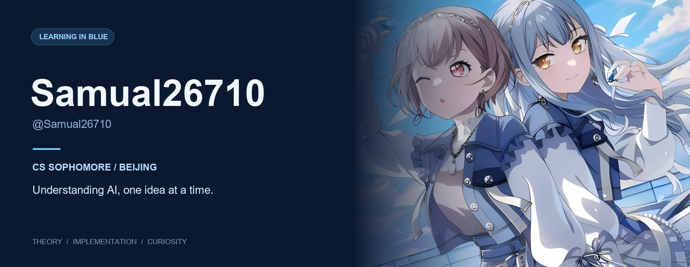
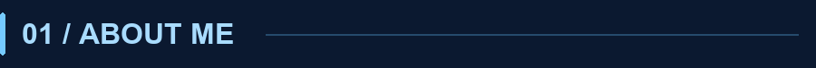
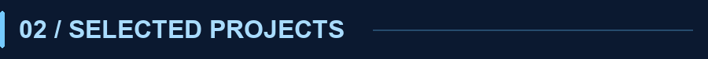
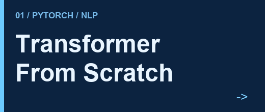
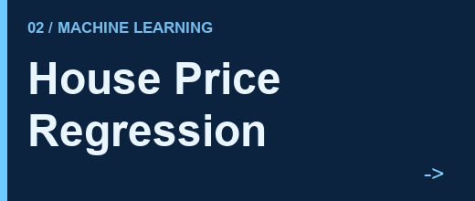
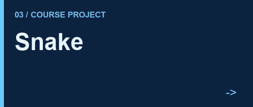
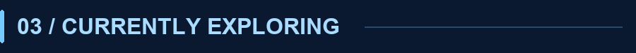
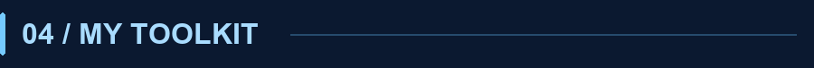
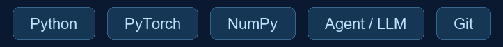
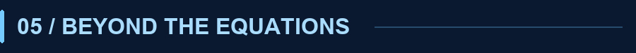

  

<h3 align="center">从公式到代码，慢慢理解智能。</h3>

Learning the theory. Building the intuition.

---

<h3></h3>

Hi, I'm **Samual26710**.

北京的一名 **CS 大二学生**，正在学习 **人工智能理论**。
希望不只把模型跑起来，也能理解它为什么有效：从数学直觉出发，通过手写实现与小规模实验，把抽象的概念变得具体。

I'm a CS sophomore based in Beijing, learning AI theory through implementations, experiments, and notes.

<h3></h3>

<table>
<tr><td width="32%"></td><td>从零手写面向英中翻译的 Transformer，串联数据处理、模型训练与自回归评估。</td></tr>
<tr><td width="32%"></td><td>基于 Kaggle 房价数据，通过特征工程、五折交叉验证与多模型加权集成预测房屋成交价。</td></tr>
<tr><td width="32%"></td><td>北京邮电大学程序设计课程大作业：贪吃蛇游戏。</td></tr>
</table>

<h3></h3>

- **AI & language models** — 学习 CS336，理解 Attention、Transformer 与语言模型的基本原理。
- **From scratch** — 从逻辑回归到 Transformer，用 Python / PyTorch 练习实现、训练与评估。
- **CS foundations** — 学习 CSAPP，补足计算机系统基础，让知识逐渐连成一张网。

<h3></h3>

<h3></h3>

也会尝试聊天机器人、实用小工具和 vibe coding，把偶然冒出的想法做成可以使用的东西。

✦

保持好奇，允许自己慢一点。 Stay curious. Keep building.

<!-- Cover: local preview of the currently configured Wallpaper Engine Monitor0 wallpaper.
Workshop source: https://steamcommunity.com/sharedfiles/filedetails/?id=3570954450
Artwork is not claimed as original work. -->
